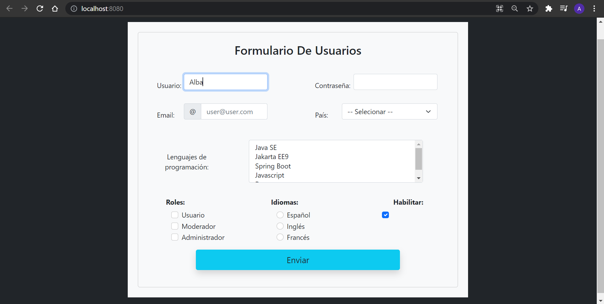

# Project com.alba.first_app.form/First_Web_App_Form

Steps to run this project:

1. Start your Docker daemon
2. Execute `./buildAndRun.sh` (Linux/MacOs) or `buildAndRun.bat` (Windows)
3. Wait until Open Liberty is up- and running (e.g. use `docker logs -f CONTAINER_ID`)
4. Visit http://localhost:9080/resources/sample

# a little description of the proyect :scroll:

---

> :hibiscus: A little first App runing with Apache 9.0.50. JSP view desing made wiht Boostrap 5.0.
Is a functional form which collect the data of the user and verify if all the input
have the right information to be send. I manage this with a Servlet. :hibiscus:

